# Walkability Population Prediction from Satellite Imagery and OSM Features

## Introduction

### Problem

Understanding how many people can be reached on foot from any given urban location is a fundamental question in urban mobility and city planning. A key tool for answering it is the concept of an **isochrone**: a polygon that delimits the area reachable from a point within a fixed travel time, computed from the actual pedestrian street network. We use [**ISO4APP**](https://www.iso4app.net/) to generate 15-minute walking isochrones and retrieve the population living within each one. An example is shown below:

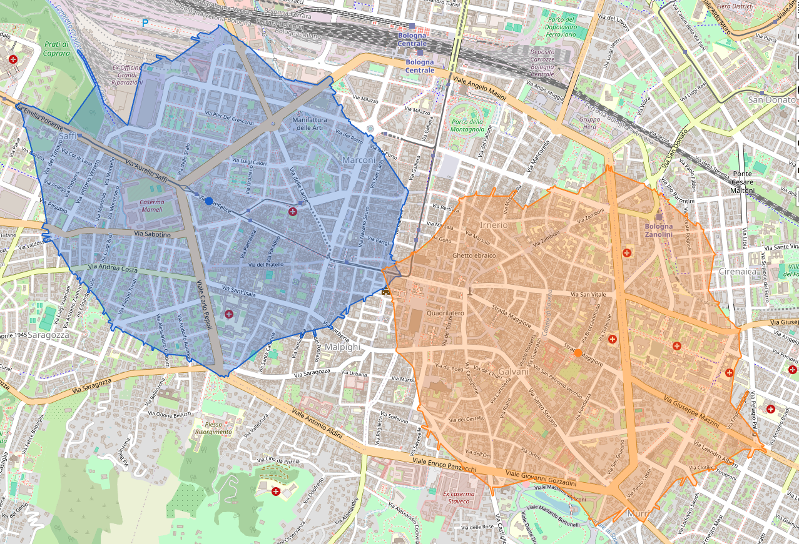

While isochrone computation is straightforward for a single point, producing a dense, city-wide map of walkable population access requires querying thousands of locations, a process that is computationally expensive and scales poorly across multiple cities. The goal of this work is to learn a model that can predict this quantity directly from freely available geospatial data, making city-wide population access maps fast and scalable.

### Our Goal

The goal of this project is to **predict the population reachable within a 15-minute walk** from any urban point, using a fusion of multi-channel satellite imagery and OpenStreetMap tabular features, across 80 European cities. Rather than running routing simulations at inference time, we train a deep learning model to estimate walkable population access from remote sensing data alone, enabling dense spatial predictions at low cost.

### Literature

Our work takes direct inspiration from Doda et al. [3] ("Interpretable deep learning for consistent large-scale urban population estimation using Earth observation data", International Journal of Applied Earth Observation and Geoinformation, 2024), which proposed a dual-branch ResNet-50 framework combining satellite imagery with OSM tabular features for population estimation across European cities. Like their work, we adopt a multi-modal architecture that fuses image-like raster data (RGB, DEM, land use) with vector-based OSM statistics through a dual-branch design, and we similarly apply explainability techniques to interpret model predictions.

However, our work differs in several key aspects: rather than predicting static grid-level population density at 1 km resolution using census data as ground truth, we predict walkable population access, a mobility-based measure computed from actual pedestrian routing simulations, which is a fundamentally different and more dynamic target. Furthermore, we conduct a systematic ablation study across multiple backbone architectures (EfficientNet-B3, ConvNeXt-Tiny, ResNet-50, DINOv2) and fusion strategies (concatenation, cross-attention, FiLM [2], DANN [1]), going beyond a single fixed architecture to investigate what design choices matter most for this task.

---

## Setup

### Repository Structure

```
OptimalAccessPointPrediction/
├── dataset_creation/               # Scripts to build the raw dataset from scratch
│   ├── city_bounding_box_generator.py   # Step 1: extract city bounding boxes via OSMnx
│   ├── point_clusters_generator.py      # Step 2: sample & cluster points per city
│   ├── population_isochrones_generator.py  # Step 3: enrich points with ISO4APP isochrones
│   └── sentinel2_images_generator.py    # Download Sentinel-2 imagery via STAC API
│
├── ablation/                       # All model training, evaluation and visualisation code
│   ├── configs/
│   │   └── config.py               # Dataclass configs for every experiment
│   ├── data/
│   │   ├── preprocess.py           # One-time cache builder (GeoTIFF → memory-mapped arrays)
│   │   ├── dataset.py              # CachedDataset used during training
│   │   ├── city_split.json         # Deterministic city-level train / val / test split
│   │   └── compute_rgb_stats.py    # Per-city RGB mean/std (optional)
│   ├── models/
│   │   ├── factory.py              # build_model() dispatcher
│   │   ├── single_branch.py        # Image-only model
│   │   ├── dual_branch.py          # Image + tabular fusion model (concat / cross-attn / FiLM / DANN)
│   │   ├── tabular_only.py         # OSM-only MLP baseline
│   │   ├── grad_reverse.py         # Gradient Reversal Layer for DANN
│   │   └── backbones/              # ResNet-50, EfficientNet-B3, ConvNeXt-Tiny, DINOv2
│   ├── training/
│   │   ├── trainer.py              # Training loop, logging, checkpointing
│   │   └── metrics.py              # MAE, RMSE, R² helpers
│   ├── scripts/                    # One runnable script per model variant
│   │   ├── train_dann_dinov2.py    # Best model
│   │   ├── train_dual_convnext.py
│   │   ├── train_dual_efficientnet.py
│   │   ├── train_dual_resnet50.py
│   │   ├── train_dual_dinov2.py
│   │   ├── train_single_{resnet50,efficientnet,convnext,dinov2}.py
│   │   ├── train_rgb_only_{efficientnet,dinov2}.py
│   │   ├── train_crossattn_{efficientnet,convnext}.py
│   │   ├── train_film_efficientnet.py
│   │   ├── train_tabular_only.py
│   │   └── evaluate.py             # Standalone evaluation on a saved checkpoint
│   ├── visualize_umap.py           # UMAP of backbone feature space
│   ├── visualize_shap.py           # SHAP / gradient attribution for the tabular branch
│   ├── visualize_country_errors.py # Per-country MAE breakdown
│   ├── run_visualize.py            # Batch runner for all visualisations
│   ├── requirements.txt
│   └── setup_vastai.sh             # One-shot environment setup for Vast.ai GPU instances
│
├── requirements.txt                # Dependencies for dataset_creation/ scripts only
├── img/                            # All figures used in this report
└── report.md
```

### Installation

The repository has two separate dependency sets:

**Dataset creation** (run once locally to build the raw dataset):

```bash
pip install -r requirements.txt   # numpy, pandas, geopandas, osmnx, rasterio, etc.
```

**Model training and evaluation** (run on a GPU machine or cloud instance):

```bash
cd ablation/
pip install -r requirements.txt   # torch, torchvision, timm, wandb, umap-learn, etc.
```

> The training scripts were developed and benchmarked on an **NVIDIA RTX 3090** via Vast.ai. For a Vast.ai cloud instance, `setup_vastai.sh` installs all required packages in one step:
>
> ```bash
> bash ablation/setup_vastai.sh
> ```

### Dataset Pipeline

The dataset must be built before training. Run the following steps **in order**:

```bash
# Step 1 — Define city boundaries
python dataset_creation/city_bounding_box_generator.py
# Output: cities_bboxes_major_europe.json

# Step 2 — Sample points, compute OSM density metrics, cluster, and stratify
python dataset_creation/point_clusters_generator.py
# Output: final_clustered_samples.json  (one record per sample point with cluster ID)

# Step 3 — Enrich each point with a 15-min walking isochrone and population count
#           (requires an ISO4APP API key)
python dataset_creation/population_isochrones_generator.py
# Output: updates final_clustered_samples.json in-place

# Step 4 — Download Sentinel-2 imagery for each city (requires STAC API access)
python dataset_creation/sentinel2_images_generator.py
```

Alternatively, the preprocessed dataset is available on Hugging Face:

```bash
python3 -c "
from huggingface_hub import snapshot_download
snapshot_download(
    repo_id='fedemarchits/populationAccess',
    repo_type='dataset',
    local_dir='/path/to/PopulationDataset'
)
"
```

### Preprocessing (one-time cache build)

Raw GeoTIFF rasters are slow to read during training. A one-time script extracts all image crops and stores them as memory-mapped NumPy arrays:

```bash
python ablation/data/preprocess.py \
    --json /path/to/final_clustered_samples.json \
    --base /path/to/PopulationDataset \
    --out  /path/to/PopulationDataset/cache
```

This takes ~20–40 minutes on an SSD and produces the `cache/` directory with `rgb.dat`, `dem.dat`, `landuse.dat`, `tabular.npy`, `targets.npy`, and an `index.json` manifest.

### Training

Each model variant has a dedicated script under `ablation/scripts/`. Edit the `JSON_FILE`, `BASE_DIR`, and `CACHE_DIR` constants at the top of the script to point to your data, then run:

```bash
cd ablation/

# Train the best model (DANN + DINOv2)
python scripts/train_dann_dinov2.py

# Train other variants, e.g.:
python scripts/train_dual_convnext.py
python scripts/train_single_efficientnet.py
python scripts/train_tabular_only.py
```

All runs log metrics to **TensorBoard** and optionally to **Weights & Biases** (set `use_wandb=False` in the config or run `export WANDB_MODE=disabled` to disable W&B). Checkpoints are saved under `ablation/outputs/<run_name>/`.

### Evaluation & Visualisation

```bash
# Evaluate a saved checkpoint on the test set
python ablation/scripts/evaluate.py \
    --run dann_dinov2_vitb14 \
    --model dann \
    --backbone dinov2_vitb14

# UMAP projection of backbone feature space
python ablation/visualize_umap.py \
    --run dann_dinov2_vitb14 --model dann --backbone dinov2_vitb14

# SHAP / gradient attribution for the tabular branch
python ablation/visualize_shap.py \
    --run dann_dinov2_vitb14 --model dann --backbone dinov2_vitb14

# Per-country MAE breakdown
python ablation/visualize_country_errors.py \
    --run dann_dinov2_vitb14 --model dann --backbone dinov2_vitb14

# Run all visualisations for all models at once
python ablation/run_visualize.py
```

---

## Data Collection

### Selected Cities

We chose to focus exclusively on Europe for our case study for the following reasons:

- **European cities** share a **distinctive urban structure**. We limited data collection to cities with this characteristic, excluding those with fundamentally different layouts (such as American and Chinese cities);

- **Abundant free geospatial data** is available for Europe.

Moreover, we selected countries for which population data is available via [**iso4app**](https://www.iso4app.net/).

This dataset considers **80 major cities** in **12 different European Countries**. Below the list of the cities considered.

| 🇮🇹 **Italy** (9) | 🇫🇷 **France** (10) | 🇬🇧 **United Kingdom** (9) |
| ---------------- | ------------------ | ------------------------- |
| Rome             | Paris              | London                    |
| Milan            | Marseille          | Birmingham                |
| Naples           | Lyon               | Edinburgh                 |
| Turin            | Toulouse           | Leeds                     |
| Palermo          | Nice               | Liverpool                 |
| Bologna          | Nantes             | Manchester                |
| Florence         | Montpellier        | Bristol                   |
| Bari             | Strasbourg         | Sheffield                 |
| Catania          | Bordeaux           |                           |
|                  | Lille              |                           |

| 🇧🇪 **Belgium** (7) | 🇳🇱 **Netherlands** (7) | 🇸🇪 **Sweden** (7) | 🇨🇭 **Switzerland** (7) |
| ------------------ | ---------------------- | ----------------- | ---------------------- |
| Brussels           | Amsterdam              | Stockholm         | Zurich                 |
| Antwerp            | Rotterdam              | Gothenburg        | Geneva                 |
| Ghent              | The Hague              | Malmö             | Basel                  |
| Charleroi          | Utrecht                | Uppsala           | Lausanne               |
| Liège              | Eindhoven              | Västerås          | Bern                   |
| Bruges             | Tilburg                | Örebro            | Winterthur             |
| Namur              | Groningen              | Linköping         | Lucerne                |

| 🇦🇹 **Austria** (6) | 🇫🇮 **Finland** (6) | 🇵🇹 **Portugal** (6) | 🇳🇴 **Norway** (5) |
| ------------------ | ------------------ | ------------------- | ----------------- |
| Vienna             | Helsinki           | Lisbon              | Oslo              |
| Graz               | Espoo              | Porto               | Bergen            |
| Linz               | Tampere            | Vila Nova de Gaia   | Trondheim         |
| Salzburg           | Vantaa             | Amadora             | Stavanger         |
| Innsbruck          | Oulu               | Braga               | Tromsø            |
| Klagenfurt         | Turku              | Coimbra             |                   |

| 🇩🇰 **Denmark** (1) | 🇬🇷 **Greece** (2) |
| ------------------ | ----------------- |
| Copenhagen         | Volos             |
|                    | Thessaloniki      |

### Input Data for Each City & Labels

For each city we need to gather the following data:

- **RGB image** of the city;
- **DEM height** of building in the city;
- **Segmentation Map** of each pixel;
- **OSM Tabular Data**

And we will train the model to learn, given the aforementioned data, the amount of population reachable from each point in the city in 15 minutes walking. In order to get the label to use in order to predict, we need a trustworthy source of data, we then decided to exploit [**iso4app**](https://www.iso4app.net/) API to get the population.

## RGB Images (Sentinel-2 | Copernicus)

The RGB images are from the **Sentinel-2** satellite [6] at **10m resolution**. RGB data are derived from the **Sentinel-2 L2A** satellite mission.

**Key Features & Methodology:**

- **Census-Aligned Temporal Synchronization:**

  We dynamically adjusted the search window for each city to match the specific year of its national census (e.g., _Summer 2018_ for Switzerland, _Summer 2023_ for Italy). This ensures the physical urban fabric observed in the images corresponds accurately to the demographic data used in the analysis. More specifically these are the population data available:

  | Country            | Population Source  | Census Year | Satellite Image Year\* |
  | :----------------- | :----------------- | :---------- | :--------------------- |
  | **Austria** 🇦🇹     | HDX                | 2020        | 2020                   |
  | **Belgium** 🇧🇪     | STATBEL            | 2020        | 2020                   |
  | **Denmark** 🇩🇰     | DST                | 2024        | 2023                   |
  | **Finland** 🇫🇮     | STATISTICS FINLAND | 2022        | 2022                   |
  | **France** 🇫🇷      | INSEE census       | 2020        | 2020                   |
  | **Greece** 🇬🇷      | GEODATA.GOV.GR     | 2020        | 2020                   |
  | **Italy** 🇮🇹       | ISTAT census       | 2024        | 2023                   |
  | **Netherlands** 🇳🇱 | CBS                | 2022        | 2022                   |
  | **Norway** 🇳🇴      | SSB                | 2024        | 2023                   |
  | **Portugal** 🇵🇹    | INE                | 2018        | 2018                   |
  | **Sweden** 🇸🇪      | SCB                | 2020        | 2020                   |
  | **Switzerland** 🇨🇭 | STATPOP            | 2018        | 2018                   |

  You can check directly on [**iso4app**](https://www.iso4app.net/) website for specifications about the census data we used.
  In order to get high quality images of city we followed 2 techniques:

- **Seasonal Consistency (European Summer):**
  - All images are restricted to the months of **June through September**.
  - This "Summer Window" is critical for Northern Europe (e.g., Norway, Finland) to ensure scenes are **snow-free** and have maximum solar elevation (minimizing long shadows in urban canyons)..

- **Cloud-Free Mosaicing:**
  - Queries the **Sentinel-2 L2A** collection via the STAC API, strictly filtering for scenes with **<85% cloud cover**, basically keeping only those images where a portion of the city is visible.
  - When multiple passes are available, it computes a **median pixel composite**. This technique effectively removes transient clouds, shadows, and artifacts that might appear in a single flyover, resulting in a clean, obstruction-free image.

Examples below of satellite images for **Bologna** and **Nantes**:

<table>
  <tr>
    <td align="center">
      
      <br />
      <sub><b>Figure 1:</b> Sentinel-2 Capture of Bologna, Italy</sub>
    </td>
    <td align="center">
      
      <br />
      <sub><b>Figure 2:</b> Sentinel-2 Capture of Nantes, France</sub>
    </td>
  </tr>
</table>

## Height Data (Copernicus DEM)

For elevation data, we utilize the **Copernicus DEM (GLO-30)** [7], which provides global coverage at 30m resolution. While the native resolution is 30m, we **upsample** using **bilinear interpolation** to match our target **10m** tensor grid.
The **output** will be a single-channel representing absolute elevation in meters.

## Land Use Data (OpenStreetMap)

To distinguish between functional urban zones (e.g., Commercial vs. Residential), we generate land use masks directly from **OpenStreetMap (OSM)** [8].
We _rasterize_ these polygons onto the target **10m pixel grid**, aligning them perfectly with the Sentinel-2 pixels.

- **Classes**: The resulting single-channel image contains integer codes representing:
  - Residential
  - Commercial/Office
  - Industrial
  - Retail
  - Public/Education
  - Parks/Leisure
  - Natural/Water
  - Other/Background

- **Tensor Transformation**: This channel is **One-Hot Encoded** during training into **8 binary channels** (one for each active class).

## OSM Tabular Data

In addition to the raster channels, each sample is enriched with a set of **15 numeric tabular features** derived from OpenStreetMap [8] vector data. These features capture the urban fabric around each point in a way that satellite imagery alone cannot easily quantify, such as the connectivity of the road network or the diversity of amenities.

For each sample point, all features are computed within a circular buffer whose radius matches exactly the extent of the satellite image patch. This ensures the tabular branch of the model sees the same area as the image branch. The 15 features are:

|  #  | Feature                 | Source     | Description                                                                                    |
| :-: | :---------------------- | :--------- | :--------------------------------------------------------------------------------------------- |
|  1  | Total road length       | Road edges | Sum of the lengths of all road segments inside the buffer (meters)                             |
|  2  | Road segment count      | Road edges | Number of individual road segments                                                             |
|  3  | Road density            | Road edges | Total road length divided by the buffer area — a measure of how built-up the street network is |
|  4  | Node count              | Road nodes | Total number of road network nodes (dead-ends and intersections)                               |
|  5  | Intersection count      | Road nodes | Nodes where 3 or more roads meet — a proxy for network connectivity and walkability            |
|  6  | Building count          | Buildings  | Number of building footprints                                                                  |
|  7  | Building footprint area | Buildings  | Total ground area covered by buildings (square meters)                                         |
|  8  | Building coverage ratio | Buildings  | Building footprint area divided by buffer area — a density ratio between 0 and 1               |
|  9  | POI count               | POIs       | Total number of points of interest                                                             |
| 10  | Amenity count           | POIs       | POIs tagged as amenities (cafes, schools, hospitals, etc.)                                     |
| 11  | Shop count              | POIs       | POIs tagged as shops                                                                           |
| 12  | Leisure count           | POIs       | POIs tagged as leisure (parks, sports facilities, etc.)                                        |
| 13  | Tourism count           | POIs       | POIs tagged as tourism (museums, monuments, hotels, etc.)                                      |
| 14  | Office count            | POIs       | POIs tagged as offices                                                                         |
| 15  | Transport stop count    | Transport  | Number of public transport stops and stations                                                  |

## Target Label Generation

### 1. City Bounding Box Generator

This script initializes the project by defining the geographical scope. It iterates through the cities listed earlier and uses OpenStreetMap via OSMnx [4] to retrieve their geographical boundaries.

- **Logic**:
  - Geocodes each city name to a GeoDataFrame.
  - Extracts the `total_bounds` (min/max lat/lon).
  - Formats coordinates into a polygon structure.
- **Output**: `cities_bboxes_major_europe.json` containing the bounding box coordinates for each successfully processed city.

### 2. Parallel Sampling & Clustering

We move from raw bounding boxes to a set of intelligent, **representative points** for analysis.

- **Logic**:
  1. **Adaptive Grid**: Generates a grid of candidate points within the city bounding box.
  2. **Metric Calculation**: For every grid point, it calculates density within a 1km buffer:
  - _Road Density_: Total length of road network.
  - _Building Density_: Total footprint area of buildings.
  - _POI Density_: Count of amenities, shops, and offices.
  3. **K-Means Clustering**: Normalizes these metrics and groups points into **5 clusters** (representing different urban fabrics, e.g., "Dense Historic Center", "Residential", "Sparse Industrial").
  4. **Stratified Sampling**: Selects a fixed number of random points (default: 100) from each cluster to ensuring the final dataset represents the full diversity of the city.

Examples below:

<table>
  <tr>
    <td align="center">
      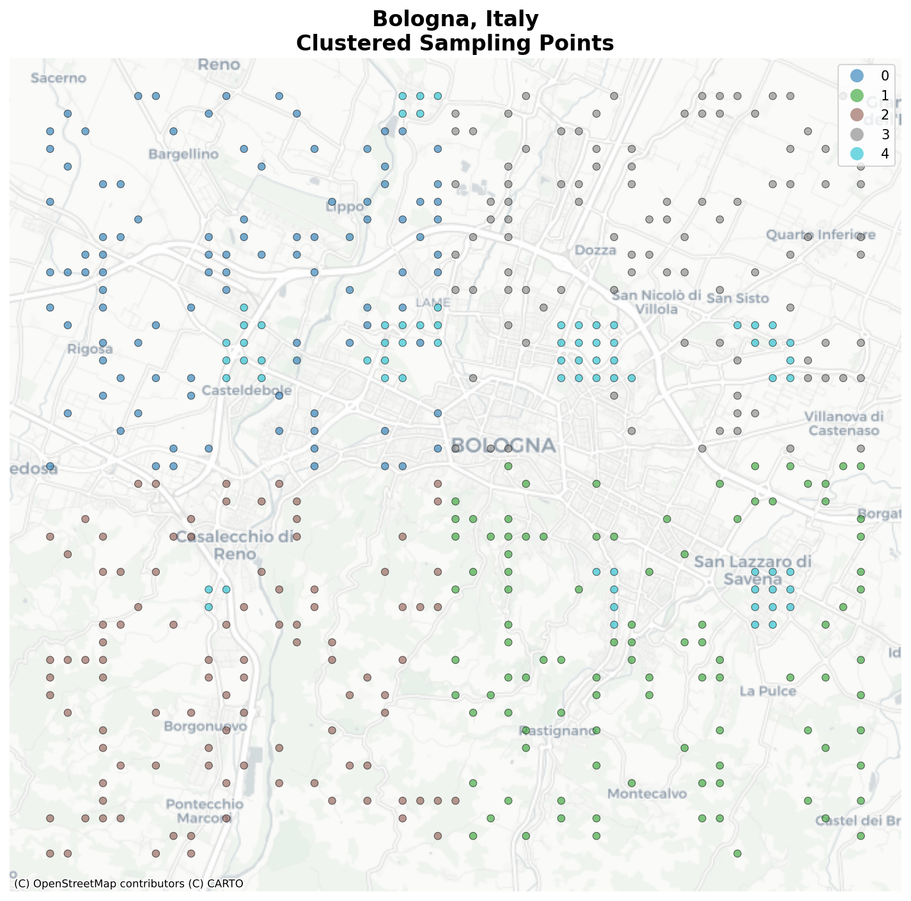
      <br />
      <sub><b>Figure 1:</b> Clustered Points of Bologna, Italy</sub>
    </td>
    <td align="center">
      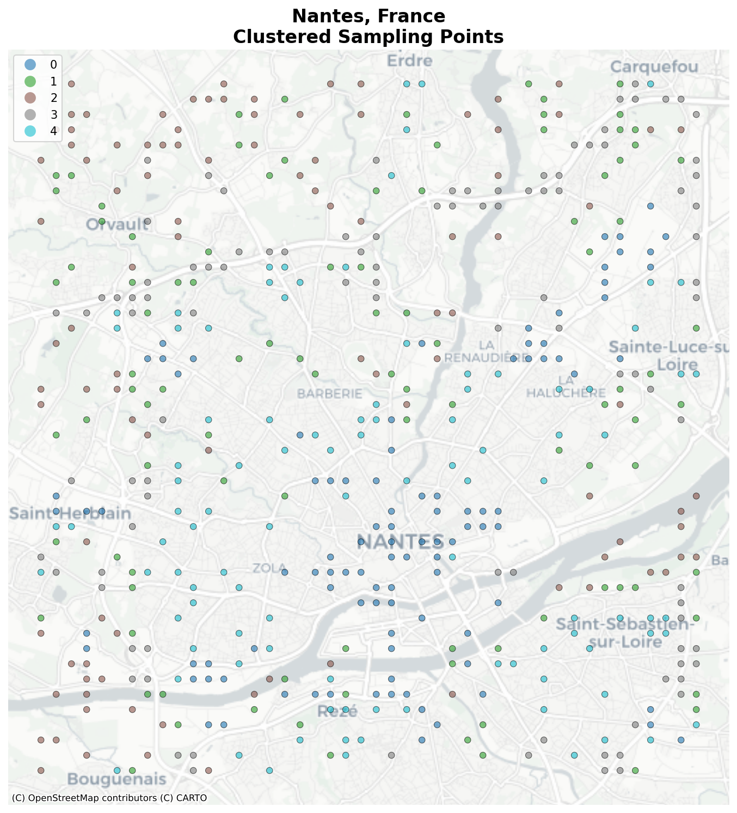
      <br />
      <sub><b>Figure 2:</b> Clustered Points of Nantes, France</sub>
    </td>
  </tr>
</table>

### 3. Isochrone Enrichment

We then added mobility data to the clustered points using the [**iso4app API**](https://www.iso4app.net/).

- **Logic**:
  - **Isochrone Calculation**: Queries the API for a 15-minute walking polygon (pedestrian mobility) starting from the point's coordinates.
  - **Population Lookup**: Uses the generated polygon to query the API for the total population living within that specific walking area.
  - **Error Handling**: Includes retry logic and periodic saving (every 50 points) to prevent data loss.
- **Output**: Updates `final_clustered_samples.json` by appending:
  - `walking_isochrone`: The GeoJSON geometry of the walkable area.
  - `population_15min_walk`: The integer count of people inside that area.
  - `approximation_meters`: Distance from the query point to the nearest walkable street.

## Dataset Creation

What we want to achieve for the input is a **3D tensor** with:

- **12 channels** (expanded from raw data);
- **H x W** pixels depending on the city;
- **10m spatial resolution**.

Each channel is explained below:

| Channel                    | Source                  | Resolution             |
| :------------------------- | :---------------------- | :--------------------- |
| **RGB** _3 channels_       | Sentinel-2 (Copernicus) | 10m                    |
| **Height** _1 channel_     | Copernicus DEM (GLO-30) | 30m (Upsampled to 10m) |
| **Vegetation** _1 channel_ | Sentinel-2 (Calculated) | 10m                    |
| **Land Use** _8 channels_  | OpenStreetMap (OSM)     | 10m                    |

## Preprocessing & Normalization

Each input channel and the population target go through a dedicated normalization strategy, chosen to match the statistical properties of that particular data type.

### RGB (3 channels)

Two operation are applied on the RGB channels:

- **ImageNet Normalization** since all models used were pre-trained on ImageNet;
- **Per-city standardization** is also applied, using the mean and standard deviation computed from the valid pixels of each city's full satellite image. This is done in order to:
  - remove the global brightness differences that arise from varying atmospheric conditions across different countries and years
  - remove typical specific colors of the countries (such as terracotta roofs in Italy);

This was done to prevent the model from overfitting on specific typical characteristics of each country, and be better at **generalising**.

### Height / DEM (1 channel)

Elevation is normalized at preprocessing time using a fixed global range of −50 m to 3000 m, which comfortably covers all European terrain from below-sea-level areas to the highest Alpine peaks. The raw elevation value is linearly scaled into the 0–1 range using these fixed bounds and stored as a float.

### Land Use (8 channels)

The land use map is stored as a single channel of integer class codes (values 0–7, one per category). At training time, this single channel is expanded into 8 independent binary channels via **one-hot encoding**: each channel becomes a binary mask that is 1 where the corresponding land use class is present and 0 everywhere else. This prevents the model from treating the integer codes as an ordinal or continuous signal, a pixel labeled "Industrial" (4) is not "more" than a pixel labeled "Residential" (1).

### Tabular OSM Features

The raw OSM tabular features (counts of roads, buildings, POIs, etc.) follow a heavily skewed distribution, with a few very dense city centers pulling the values far above the typical range. To address this:

1. A **log transformation** is first applied to compress the long tail and bring values into a more symmetric range.
2. The result is then **z-score normalized** using the mean and standard deviation computed exclusively from the **training split**. These statistics are then applied unchanged to the validation and test sets, preventing any information leakage from unseen data.

### Normalization of Labels

The raw population labels require the most careful treatment due to their extremely skewed, heavy-tailed distribution:

- **Log transformation**: We log-transformed the population value of each point, compressing the wide range of populations into a much narrower and more symmetric distribution.
- **Per-city z-score normalization**: The log-transformed value is then standardized using the mean and standard deviation of all log-transformed population values belonging to that same city. This removes the systematic between-city scale differences — a mid-density point in Milan and a mid-density point in Tromsø will receive comparable normalized scores, even though their absolute populations differ by orders of magnitude. Because the train/validation/test splits are defined at the city level (entire cities are either in train or in test, never split across both), computing these statistics over all samples of a city does **not** cause any **data leakage**.

At evaluation time, predictions are converted back to the original population scale by reversing the z-score and then applying the inverse of the log transformation.

## Ablation Study

The ablation study follows a progression of five steps, each adding one component on top of the previous. This structure makes it easy to measure the marginal contribution of every design decision. All models share the same training infrastructure.

**Shared training configuration:**

All models are trained end-to-end using **Huber loss** for robustness to population outliers, optimized with **AdamW** and a **ReduceLROnPlateau** scheduler that halves the learning rate on validation plateaus. **Early stopping** and **gradient clipping** are applied to stabilize training. The RGB channels receive standard data augmentation (random crops, horizontal/vertical flips, and color jitter), while the non-RGB channels are augmented geometrically only. All experiments were run on an **NVIDIA RTX 3090** (Vast.ai cloud GPU).

All metrics are computed on the **test set of 12 unseen cities**, with targets denormalized to absolute population counts.
**Evaluation metrics:**

- **MAE** (Mean Absolute Error) the average prediction error in number of people. Most interpretable metric: an MAE of 5,000 means the model is off by ~5,000 residents on average.

  `MAE = (1/N) Σ |ŷᵢ − yᵢ|`

- **RMSE** (Root Mean Squared Error) like MAE but penalises large errors more heavily, since errors are squared before averaging.

  `RMSE = √( (1/N) Σ (ŷᵢ − yᵢ)² )`

- **R²** (Coefficient of Determination) measures how much of the variance in population the model explains, from 0 (no better than predicting the mean) to 1 (perfect). This is the primary metric for comparing models.

  `R² = 1 − Σ(ŷᵢ − yᵢ)² / Σ(ȳ − yᵢ)²`

**City-Scale Prediction Heatmaps**

To visualize what the models have learned, we generate full-city population access maps by running inference across the entire satellite image of a city. The result is a continuous heatmap where each pixel reflects the model's estimate of how many people are reachable within a 15-minute walk from that location.

Heatmaps are shown for **Bologna** and **Milan**, two Italian cities that were part of the test set and therefore never seen during training.

---

### Single Branch Architecture

The single-branch model relies exclusively on the satellite image patch. It passes the full 12-channel input, RGB, elevation, and land-use, through a pretrained image backbone, which compresses the spatial information into a compact feature vector. A small regression head then maps this vector to the predicted population score. Four backbones are evaluated in this configuration: ResNet-50, EfficientNet-B3, ConvNeXt-Tiny, and DINOv2 ViT-B/14.

<p align="center">
  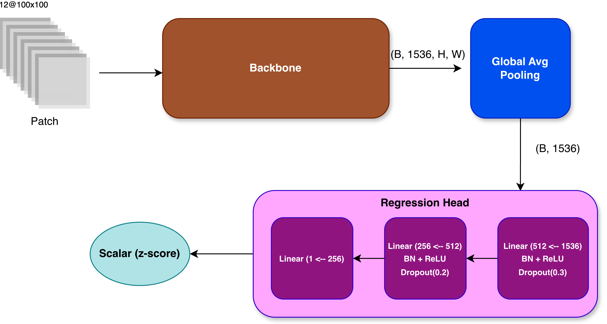
</p>

#### Step 1 | RGB-Only Baseline

The starting point is the simplest possible model: a standard pretrained backbone receiving only the **3 RGB channels** of the Sentinel-2 image. No elevation, no land-use, no tabular data. This answers the fundamental question: _what can visual appearance alone tell us about walkable population?_

Two backbones are tested: EfficientNet-B3 and DINOv2 ViT-B/14. Both use their original pretrained weights without any channel modification.

| Model                    | MAE ↓ | RMSE ↓ | R² ↑  |
| ------------------------ | ----- | ------ | ----- |
| rgb_only_efficientnet_b3 | 9,053 | 14,247 | 0.133 |
| rgb_only_dinov2_vitb14   | 9,160 | 13,992 | 0.138 |

Both models plateau at R² ≈ 0.13. The conclusion is that: **satellite visual appearance alone is a very weak predictor of walkable population**. A dense block of rooftops looks the same whether it holds 500 or 5,000 residents. The model cannot distinguish a well-connected street grid from a dead-end neighborhood just by looking at it. Probably the 10m resolution is not enough to provide to the model the information required to predict an estimation of the population.

<p align="center">
  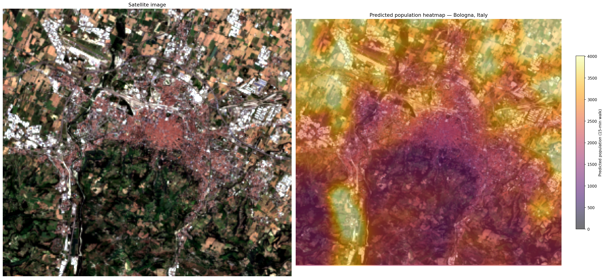
  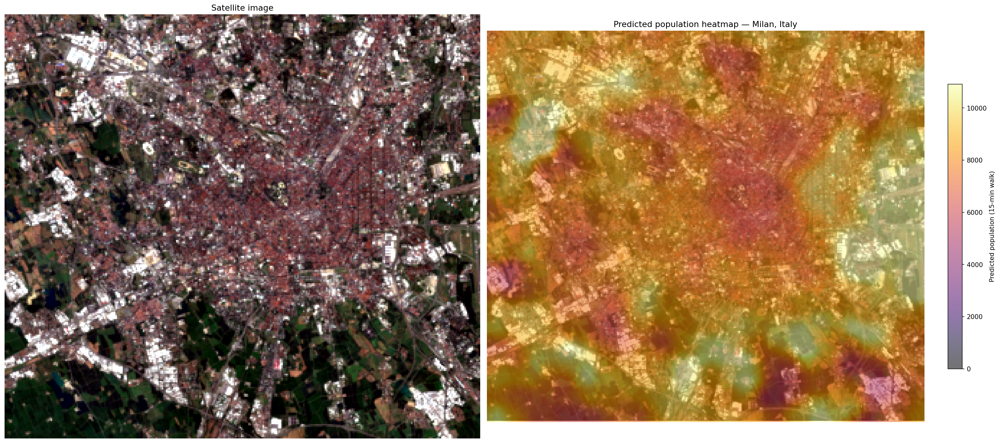
</p>
<p align="center"><em></em></p>

---

#### Step 2 | 12-Channel Single Branch

The next step enriches the image input by adding the **DEM elevation channel** and the **8-channel ESA WorldCover land-use one-hot encoding**, forming the full 12-channel tensor previously described. The backbone's first convolutional layer is expanded to accept 12 channels.

Four backbones are evaluated:

- **ResNet-50** (25M params, feat_dim=2048)
- **EfficientNet-B3** (12M params, feat_dim=1536)
- **ConvNeXt-Tiny** (28M params, feat_dim=768)
- **DINOv2 ViT-B/14** (86M params, feat_dim=768) 3-epoch warmup, backbone lr = 1×10⁻⁶

| Model                  | MAE ↓ | RMSE ↓ | R² ↑  |
| ---------------------- | ----- | ------ | ----- |
| single_resnet50        | 8,232 | 13,935 | 0.155 |
| single_efficientnet_b3 | 8,285 | 13,965 | 0.151 |
| single_convnext_tiny   | 8,222 | 14,053 | 0.141 |
| single_dinov2_vitb14   | 8,113 | 13,228 | 0.169 |

Adding DEM and land-use brings a small but consistent improvement over RGB-only (~0.13 → ~0.15–0.17 R²). Terrain context and land-cover labels help the model distinguish built-up fabric from parks and water. However, all four models remain far below what a useful predictor would require. The ceiling of image-based prediction is clear: **the visual modality encodes what a place looks like, but not necessarily the reachable population**.

DINOv2 is the best single-branch model (R²=0.169), but its advantage here is modest. Its decisive contribution will only emerge later in combination with domain adaptation.

<p align="center">
  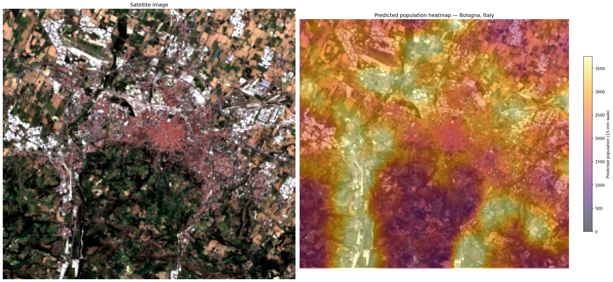
  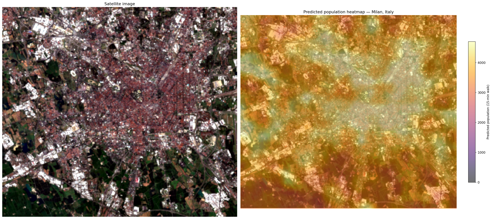
</p>
<p align="center"><em></em></p>

It seems that is able to better identify the ciy centre and, for example for Bologna, does not show population in hills area. We can state that there is a visual improvement in the heatmap compared to RGB only heatmaps.

---

### Step 3 Introducing Tabular Features

Before combining image and tabular data, a **tabular-only MLP** is trained as a reference point. It receives only the 15 OSM features with no image at all.

```
Input (15)  →  256 (BN, ReLU, 0.3)  →  128 (BN, ReLU, 0.2)  →  64 (BN, ReLU, 0.1)  →  1
```

| Model            | MAE ↓     | RMSE ↓     | R² ↑      |
| ---------------- | --------- | ---------- | --------- |
| **tabular_only** | **6,897** | **11,851** | **0.408** |

This result is the key insight of the project: **OSM structural features alone achieve R² = 0.408**. The data contains road intersection density, building coverage ratio, and POI composition, information that is very meaningful for our aim.

### Step 4 Dual Branch

The dual-branch model combines both modalities. The image branch processes the satellite patch through a backbone exactly as in the single-branch design, while a separate small network encodes the 15 OSM tabular features into a compact representation. The two are then merged and passed through a shared prediction head.

<p align="center">
  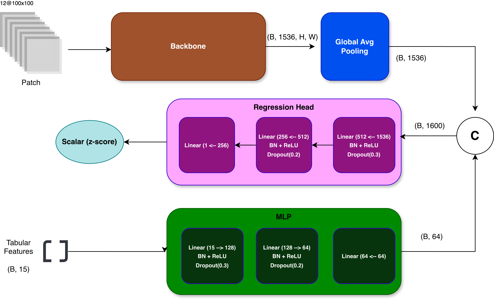
</p>

**Results**

| Model                  | MAE ↓     | RMSE ↓    | R² ↑      |
| ---------------------- | --------- | --------- | --------- |
| dual_resnet50          | 6,808     | 11,779    | 0.264     |
| dual_efficientnet_b3   | 6,065     | 10,752    | 0.459     |
| dual_dinov2_vitb14     | 5,596     | 9,813     | 0.508     |
| **dual_convnext_tiny** | **5,075** | **9,090** | **0.640** |

The results are **bimodal**: some combinations work well, others barely improve over image-only. The best model, `dual_convnext_tiny`, reaches R²=0.640 a good gain over the tabular-only baseline, confirming **complementarity** between the two modalities. The image provides visual density context invisible in the map data; tabular features provide connectivity and functional signals not recoverable from the raster.

Backbone choice is still decisive. `dual_resnet50` does not improve on the tabular only, this means the backbone is not working as expected, bringing only noise in the regression head. `dual_dinov2_vitb14` (R²=0.508) on the other hand is solid but not the best DINOv2's strength lies elsewhere, we noticed some overfitting while training DINOv2, this is probably due to its complexity, we also tried increasing augmentation, but we didn't get much better results. It seems it's able to recognise the cities just looking at the patch, and is not as good as other models at generalising.

<p align="center">
  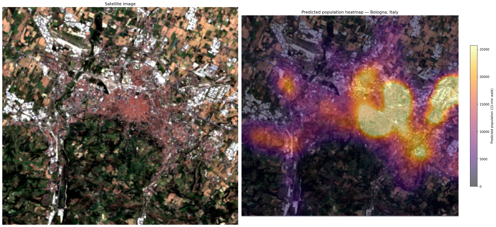
  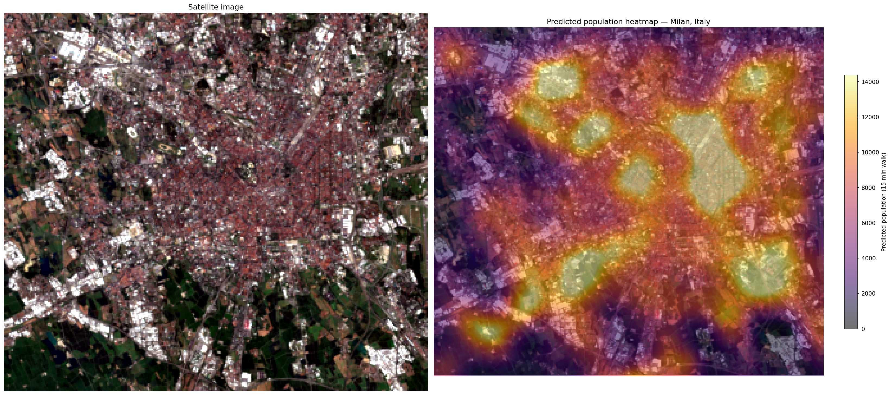
</p>
<p align="center"><em></em></p>

Here it seems the dual architecture is visually much stronger than the one branch architecture. It is now able to follow the residential area, not considering lands and hills.We are getting closer to a good prediction.

---

### 4.4 Step 4 Domain-Adversarial Training (DANN)

Even after fusion, models trained on 56 cities still internalize **country-specific visual shortcuts**: roof colors, pavement tones, and vegetation hues vary systematically across European countries. We want our model to be indipendent at test time from biases like this. This especially works for DINOv2.

Domain-Adversarial Neural Networks (DANN) [1] explicitly remove this bias. A **domain classifier** is trained to predict the source country from backbone features, while the backbone is simultaneously trained to **fool** it via a Gradient Reversal Layer (GRL).

```
x_img  →  Backbone  →  feat (D)
x_tab  →  TabularMLP  →  tab_emb (64)

Task branch:    feat + tab_emb  →  FusionHead  →  pred      [Huber loss]
Domain branch:  GRL(feat, λ)   →  DomainClassifier  →  country_logits  [CrossEntropy]

Total loss = L_task + λ(epoch) × L_domain
```

The GRL negates gradients during backpropagation, so the backbone is pushed to produce country-indistinguishable features while still minimizing regression error. The domain pressure is annealed gradually:

```
λ(epoch) = λ_max × [2 / (1 + exp(−10 × p)) − 1],    p = epoch / num_epochs
```

| Model                  | MAE ↓     | RMSE ↓    | R² ↑      |
| ---------------------- | --------- | --------- | --------- |
| dann_efficientnet_b3   | 6,738     | 11,815    | 0.439     |
| dann_convnext_tiny     | 6,152     | 11,874    | 0.612     |
| **dann_dinov2_vitb14** | **4,610** | **8,476** | **0.687** |

`dann_dinov2_vitb14` is the **best model overall** (R²=0.687, MAE=4,610). This result arises from a synergy between two factors:

1. **DINOv2's self-supervised pretraining** on 142M images produces representations that are already partially domain-generalized capturing structural and textural patterns rather than appearance shortcuts.
2. **DANN removes the residual country-level bias** yielding features that are both semantically rich and geographically invariant.

Notably, DANN _hurts_ EfficientNet (R²: 0.459 → 0.439) and modestly _hurts_ also ConvNeXt (R²: 0.640 → 0.612). Probably for an ImageNet-supervised backbones, the feature representations are too tightly coupled to visual appearances for the adversarial pressure to overcome.

<p align="center">
  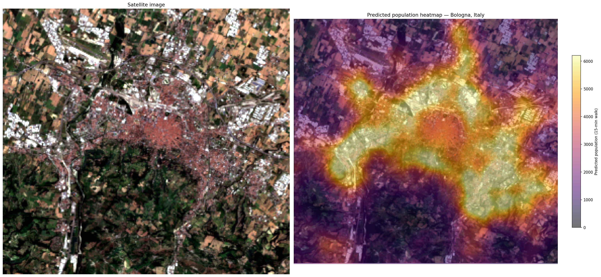
  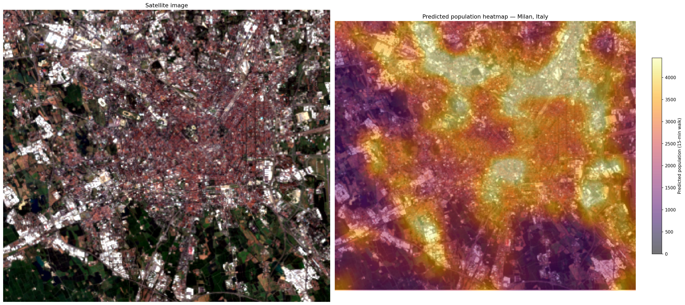
</p>
<p align="center"><em></em></p>

We exploited UMAP (Uniform Manifold Approximation and Projection) [5] since it provides a 2D visualization of the backbone feature space, enabling direct analysis of **domain invariance** the central objective of DANN training.

Backbone features are extracted and then we apply UMAP reduction with 15 neighbours.

We also computed quantitative metrics to accompany the visualization:

- **Silhouette score on country labels:** Negative values indicate successful domain mixing
- **Adjusted Rand Index** between UMAP clusters and country labels: Near-zero indicates country-invariant features

DANN + DINOv2 shows significantly less country-based clustering compared to standard dual-branch models, confirming that domain adversarial training removes geographic shortcuts without destroying task-relevant representations.

<p align="center">
  
  
</p>
<p align="center"><em>Silhouette score on country labels of dual dino and dann dino</em></p>
<p align="center">
  
  
</p>
<p align="center"><em>Umap of dual dino and dann dino</em></p>
---

### 4.5 Summary

| Model                                        | MAE ↓     | RMSE ↓    | R² ↑      |
| -------------------------------------------- | --------- | --------- | --------- |
| _RGB-only_                                   |           |           |           |
| rgb_only_efficientnet_b3                     | 9,053     | 14,247    | 0.133     |
| rgb_only_dinov2_vitb14                       | 9,160     | 13,992    | 0.138     |
| _12-ch Single Branch (image only)_           |           |           |           |
| single_resnet50                              | 8,232     | 13,935    | 0.155     |
| single_efficientnet_b3                       | 8,285     | 13,965    | 0.151     |
| single_convnext_tiny                         | 8,222     | 14,053    | 0.141     |
| single_dinov2_vitb14                         | 8,113     | 13,228    | 0.169     |
| _Tabular Only (OSM features)_                |           |           |           |
| tabular_only                                 | 6,897     | 11,851    | 0.408     |
| _Dual Branch (image + tabular)_              |           |           |           |
| dual_resnet50                                | 6,808     | 11,779    | 0.264     |
| dual_efficientnet_b3                         | 6,065     | 10,752    | 0.459     |
| dual_dinov2_vitb14                           | 5,596     | 9,813     | 0.508     |
| dual_convnext_tiny                           | 5,075     | 9,090     | 0.640     |
| crossattn_efficientnet_b3                    | 5,808     | 9,926     | 0.501     |
| crossattn_convnext_tiny                      | 8,035     | 13,536    | 0.203     |
| film_efficientnet_b3                         | 8,188     | 13,763    | 0.176     |
| _DANN (image + tabular + domain adaptation)_ |           |           |           |
| dann_efficientnet_b3                         | 6,738     | 11,815    | 0.439     |
| dann_convnext_tiny                           | 6,152     | 11,874    | 0.612     |
| **dann_dinov2_vitb14**                       | **4,610** | **8,476** | **0.687** |

The progression tells a clear story: image alone is insufficient, structural map features increase a lot our results, and domain adaptation unlocks the full potential of the best backbone (R²=0.687).

---

### Other experiments worth to be mentioned

**FiLM (Feature-wise Linear Modulation) [2]**

FiLM offers a more tightly coupled form of fusion: instead of simply concatenating the two representations at the end, the tabular features are used to directly condition the image features before they are summarized. Concretely, the map context tells the backbone which visual patterns to amplify and which to suppress, so the image representation is already "aware" of the local urban structure before producing a prediction. Despite this appealing design, FiLM did not outperform plain concatenation on our dataset, and we decided not to pursue this direction further.

**Cross-attention fusion**

Cross-attention takes a complementary angle: rather than modulating feature channels, it lets the tabular context select which spatial regions of the satellite image to focus on. The intuition is that, knowing the local road and amenity profile, the model should be able to direct its attention to the most informative parts of the image. While conceptually promising, the results were again below those of simple concatenation — likely because the spatial feature maps at this resolution are too coarse for attention to find meaningful structure. Given the poor performance, we did not pursue this approach further either.

## Conclusions

Our main findings are:

- **Satellite imagery alone is a weak predictor** (R² ≈ 0.13–0.17): visual appearance cannot distinguish a well-connected street grid from a dead-end neighborhood.
- **Adding OSM tabular features greatly improves performance**: the tabular-only MLP achieves R² = 0.408, and combining it with the image backbone in a dual-branch design brings the best model to R² = 0.640 (ConvNeXt-Tiny), confirming that the two modalities are complementary.
- **Simple concatenation fusion outperforms more complex alternatives**: cross-attention and FiLM modulation both underperform plain feature concatenation on this dataset.
- **CNNs outperform the transformer in standard training, despite being much smaller**: ConvNeXt-Tiny (28M parameters) beats DINOv2 (86M parameters) in the dual-branch setting (R² = 0.640 vs 0.508). Without domain adaptation, DINOv2's extra capacity appears to work against it — its large, expressive representations are more susceptible to overfitting country-specific visual patterns, while the lighter CNNs generalize more reliably within the training distribution.
- **Domain adaptation via DANN works extremely well with transformer-based architecture**: DINOv2's self-supervised pretraining produces partially geography-invariant features, and DANN removes the residual country-level bias, yielding the best model overall — **R² = 0.687, MAE = 4,610 people**. DANN also hurts ImageNet-supervised backbones (EfficientNet, ConvNeXt), as their representations are more tightly coupled to visual appearance.

| Stage                         | Best model    |    R²     |
| :---------------------------- | :------------ | :-------: |
| RGB-only                      | DINOv2        |   0.138   |
| Full image (12 channels)      | DINOv2        |   0.169   |
| Tabular only                  | MLP           |   0.408   |
| Dual branch (image + tabular) | ConvNeXt-Tiny |   0.640   |
| Domain adaptation             | DANN + DINOv2 | **0.687** |

---

## References

**Fusion & Domain Adaptation**

[1] Ganin, Y., Ustinova, E., Ajakan, H., Germain, P., Larochelle, H., Laviolette, F., Marchand, M., & Lempitsky, V. (2016). Domain-Adversarial Training of Neural Networks. _Journal of Machine Learning Research_, 17(59), 1–35. [arXiv:1505.07818](https://arxiv.org/abs/1505.07818)

[2] Perez, E., Strub, F., de Vries, H., Dumoulin, V., & Courville, A. (2018). FiLM: Visual Reasoning with a General Conditioning Layer. _AAAI 2018_, pp. 3942–3951. [arXiv:1709.07871](https://arxiv.org/abs/1709.07871)

**Related Work**

[3] Doda, S., Kahl, M., Ouan, K., Obadic, I., Wang, Y., Taubenböck, H., & Zhu, X. X. (2024). Interpretable deep learning for consistent large-scale urban population estimation using Earth observation data. _International Journal of Applied Earth Observation and Geoinformation_, 128, 103731. [DOI:10.1016/j.jag.2024.103731](https://doi.org/10.1016/j.jag.2024.103731)

**Tools & Data**

[4] Boeing, G. (2017). OSMnx: New methods for acquiring, constructing, analyzing, and visualizing complex street networks. _Computers, Environment and Urban Systems_, 65, 126–139. [DOI:10.1016/j.compenvurbsys.2017.05.004](https://doi.org/10.1016/j.compenvurbsys.2017.05.004)

[5] McInnes, L., Healy, J., & Melville, J. (2018). UMAP: Uniform Manifold Approximation and Projection for Dimension Reduction. [arXiv:1802.03426](https://arxiv.org/abs/1802.03426)

[6] European Space Agency. Copernicus Sentinel-2 Mission. [https://sentinel.esa.int/web/sentinel/missions/sentinel-2](https://sentinel.esa.int/web/sentinel/missions/sentinel-2)

[7] European Space Agency. Copernicus Digital Elevation Model (COP-DEM GLO-30). [https://spacedata.copernicus.eu/collections/copernicus-digital-elevation-model](https://spacedata.copernicus.eu/collections/copernicus-digital-elevation-model)

[8] OpenStreetMap contributors. OpenStreetMap. [https://www.openstreetmap.org](https://www.openstreetmap.org)
