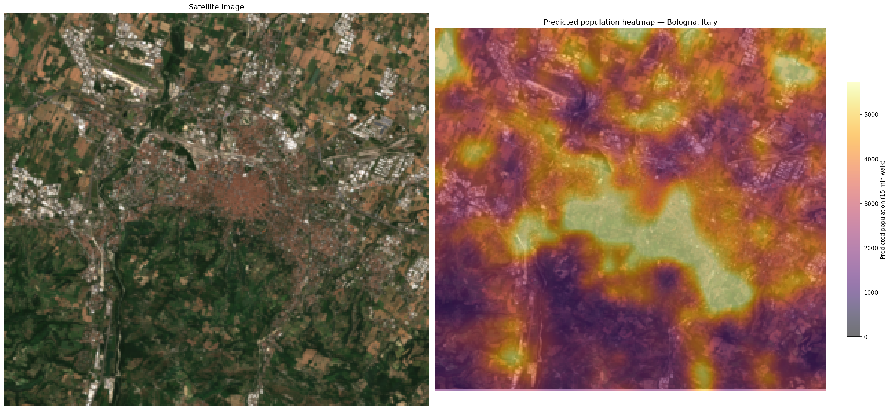
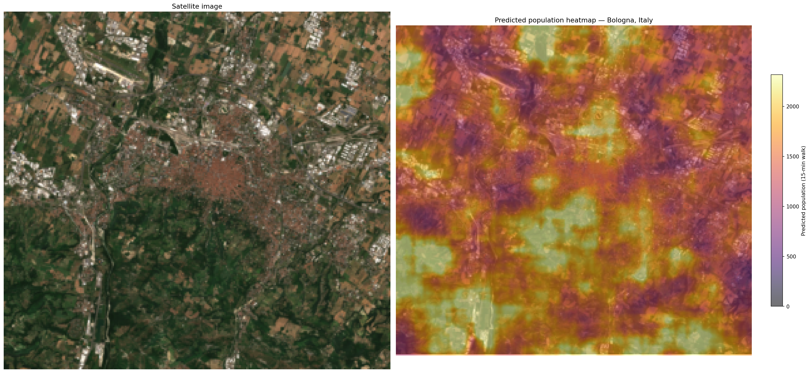

# Population Prediction — Ablation Study

Geospatial population estimation from satellite imagery and OpenStreetMap tabular features.
Each experiment uses the same **EfficientNet-B3** backbone and the same dataset split (seed=42,
70/15/15 city-level train/val/test) so that results are directly comparable.

---

## Table of Contents

1. [Ablation Study](#ablation-study)
   - [Architecture 1 — Dual-Branch (Concat Fusion)](#architecture-1--dual-branch-concat-fusion)
   - [Architecture 2 — Cross-Attention Fusion](#architecture-2--cross-attention-fusion)
   - [Architecture 3 — FiLM Conditioning](#architecture-3--film-conditioning)
   - [Results](#results)
   - [Prediction Heatmaps](#prediction-heatmaps--bologna-italy)
2. [Setup & Run Guide](#setup--run-guide)
   - [0. Upload code](#0-upload-code-to-vastai)
   - [1. Install dependencies](#1-install-dependencies)
   - [2. Download the dataset](#2-download-the-dataset)
   - [3. Preprocess](#3-preprocess-the-dataset-one-time-2040-min)
   - [4. W&B login](#4-log-in-to-weights--biases-optional)
   - [5. Run training](#5-run-training-experiments)
   - [6. Run evaluation only](#6-run-evaluation-only-if-training-crashed-before-evaluate)
   - [7. Visualize results](#7-visualize-results)

---

## Ablation Study

### Task

Predict the **residential population reachable within a 15-minute walk** from a given GPS
point, using:
- A 224×224 px multi-channel crop from the city satellite image (RGB + DEM elevation + land-use one-hot, 12 channels total)
- 15 OSM tabular features (road density, building coverage, POI counts, etc.) — used in dual-branch and attention variants

Targets are log1p-normalised during training; metrics are reported in the original population scale (people).

---

### Architecture 1 — Dual-Branch (Concat Fusion)

```
image   → EfficientNet-B3 → global avg pool → (B, 1536)  ──┐
                                                             ├─ concat → FusionHead → (B,1)
tabular → TabularMLP (15→128→64)            → (B,   64)  ──┘
```

The image and tabular branches are kept independent and their feature vectors are
**concatenated** before a shared regression head (1600→512→128→1).
This is the simplest multi-modal fusion strategy and serves as the baseline for
the richer fusion variants below.

---

### Architecture 2 — Cross-Attention Fusion

```
image   → EfficientNet-B3 (no pool) → (B, 1536, 7, 7) spatial map
                                     → flatten → (B, 49, 1536)  ← keys / values
tabular → TabularMLP                 → (B, 64)                  ← query (projected to 256)

Cross-Attention: tabular queries the 49 spatial image locations
attended output                      → (B, 256)

concat(global_pool(B,1536), attended(B,256), tab_emb(B,64)) → FusionHead → (B,1)
```

The OSM neighbourhood context (tabular) acts as a **query** that attends over the
7×7 spatial feature map of EfficientNet. This lets the model learn *where in the
image* to focus depending on the local OSM statistics — e.g. a high road density
query might focus on street intersections rather than green space.
The final representation (1856-dim) combines global image context, spatially-attended
features, and the raw tabular embedding.

---

### Architecture 3 — FiLM Conditioning

```
image   → EfficientNet-B3 (no pool) → (B, 1536, 7, 7)  spatial map
tabular → TabularMLP                 → (B, 64)
        → FiLMGenerator (64→256→256→3072) → γ (B,1536), β (B,1536)

modulated = γ * spatial + β          → (B, 1536, 7, 7)
global avg pool                       → (B, 1536)
concat tabular emb                    → (B, 1600)
FusionHead                            → (B, 1)
```

FiLM (Feature-wise Linear Modulation) uses the tabular features to generate
per-channel **scale (γ) and shift (β)** parameters applied directly to the
EfficientNet feature map before pooling. Rather than choosing *where* to look
(cross-attention), FiLM controls *which feature channels matter* for the given
neighbourhood profile. γ is initialised to 1 and β to 0 so training starts
from the same point as a plain image model.

---

### Results

All models trained with AdamW (lr=1e-4, weight_decay=5e-5), Huber loss (δ=1),
ReduceLROnPlateau scheduler (factor=0.5, patience=3), early stopping (patience=10).
Dataset: 38,134 samples across 80 European cities.

#### Validation (best epoch)

| Model | Epochs | Best Val Loss | Best Val MAE | Best Val R² |
|-------|--------|--------------|-------------|------------|
| Dual-Branch (concat) | 43 | 0.6177 (ep 13) | 3,944 (ep 22) | 0.672 (ep 26) |
| Cross-Attention | 17 | 0.6425 (ep 7) | 4,059 (ep 15) | **0.691 (ep 14)** |
| FiLM | 21 | 0.6314 (ep 11) | 4,258 (ep 16) | 0.608 (ep 7) |

#### Test Set (best checkpoint)

| Model | MAE ↓ | RMSE ↓ | R² ↑ | Loss ↓ |
|-------|-------|--------|------|--------|
| **Dual-Branch (concat)** | **6,077** | **12,915** | **0.379** | **0.643** |
| Cross-Attention | 6,287 | 13,020 | 0.369 | 0.706 |
| FiLM | 7,207 | 14,710 | 0.195 | 0.738 |

#### Per-cluster MAE (test set)

Clusters represent city typologies (0=dense urban, 4=suburban/rural).

| Model | Cluster 0 | Cluster 1 | Cluster 2 | Cluster 3 | Cluster 4 |
|-------|-----------|-----------|-----------|-----------|-----------|
| Dual-Branch | 7,475 | 6,169 | **5,292** | **5,999** | **5,488** |
| Cross-Attention | **7,238** | **6,132** | 5,455 | 7,111 | 5,651 |
| FiLM | 8,512 | 7,257 | 6,176 | 7,658 | 6,542 |

#### Discussion

- **Dual-Branch (concat)** achieves the best test MAE and R², despite its simpler
  fusion. Training for 43 epochs suggests it benefited from longer optimisation.
- **Cross-Attention** achieves the highest validation R² (0.691) suggesting it
  learns a stronger representation, but slightly underperforms on the test set —
  possibly due to the checkpoint being selected on val loss (ep 7) rather than val R².
  It also converges much faster (17 epochs vs 43).
- **FiLM** underperforms both variants on the test set despite a reasonable validation
  R² of 0.608. The channel-wise modulation may be too coarse for this task — predicting
  3,072 FiLM parameters from a 64-dim embedding is a high-dimensional mapping that
  may not generalise well with this dataset size.

---

### Prediction Heatmaps — Bologna, Italy

Dense sliding-window inference (stride=16 px) across the full city satellite image.
Colour intensity = predicted population within 15-minute walk. Heatmap overlaid on RGB.

#### Cross-Attention


#### FiLM


> Heatmap for Dual-Branch not yet generated.

---

## Setup & Run Guide

### 0. Upload code to Vast.ai

```bash
rsync -avz -e "ssh -p PORT" \
    /path/to/OptimalAccessPointPrediction/ablation/ \
    root@IP:/workspace/OptimalAccessPointPrediction/ablation/
```

### 1. Install dependencies

```bash
cd /workspace/OptimalAccessPointPrediction/ablation
bash setup_vastai.sh
pip install matplotlib scipy
```

### 2. Download the dataset

```bash
cd /workspace
pip install gdown -q
gdown --fuzzy "https://drive.google.com/file/d/1CQhyn4b3uybLYStsdxHoUaVrEIkDMTZ9/view" -O OptimalAccessDataset.zip
unzip OptimalAccessDataset.zip -d /workspace/PopulationDataset/
```

If the zip extracts into a nested folder, flatten it:

```bash
mv /workspace/PopulationDataset/PopulationDataset/* /workspace/PopulationDataset/
rm -rf /workspace/PopulationDataset/PopulationDataset /workspace/PopulationDataset/__MACOSX
rm OptimalAccessDataset.zip
```

### 3. Preprocess the dataset (one-time, ~20–40 min)

Extracts all GeoTIFF crops to numpy memmaps for fast training.

```bash
cd /workspace/OptimalAccessPointPrediction/ablation
python data/preprocess.py --json /workspace/PopulationDataset/final_clustered_samples.json --base /workspace/PopulationDataset --out /workspace/PopulationDataset/cache
```

### 4. Log in to Weights & Biases (optional)

```bash
wandb login
```

### 5. Run training experiments

| Script | Architecture | Tabular |
|--------|-------------|---------|
| `python scripts/train_single_resnet50.py` | ResNet-50 | No |
| `python scripts/train_single_efficientnet.py` | EfficientNet-B3 | No |
| `python scripts/train_single_convnext.py` | ConvNeXt-Tiny | No |
| `python scripts/train_dual_resnet50.py` | ResNet-50 + MLP concat | Yes |
| `python scripts/train_dual_efficientnet.py` | EfficientNet-B3 + MLP concat | Yes |
| `python scripts/train_dual_convnext.py` | ConvNeXt-Tiny + MLP concat | Yes |
| `python scripts/train_film_efficientnet.py` | EfficientNet-B3 + FiLM | Yes |
| `python scripts/train_crossattn_efficientnet.py` | EfficientNet-B3 + Cross-Attn | Yes |

All scripts run training + evaluation automatically. Results saved to `outputs/<run_name>/`.

### 6. Run evaluation only (if training crashed before evaluate)

```bash
python scripts/evaluate.py --run dual_efficientnet_b3 --model dual --backbone efficientnet_b3
python scripts/evaluate.py --run crossattn_efficientnet_b3 --model crossattn
python scripts/evaluate.py --run film_efficientnet_b3 --model film
```

### 7. Visualize results

Edit `run_visualize.py` to set the run name and model type, then:

```bash
python run_visualize.py
```

Copy outputs back locally:

```bash
rsync -avz -e "ssh -p PORT" root@IP:/workspace/visualizations/ ./visualizations/
rsync -avz -e "ssh -p PORT" root@IP:/workspace/OptimalAccessPointPrediction/ablation/outputs/ ./outputs/
```
