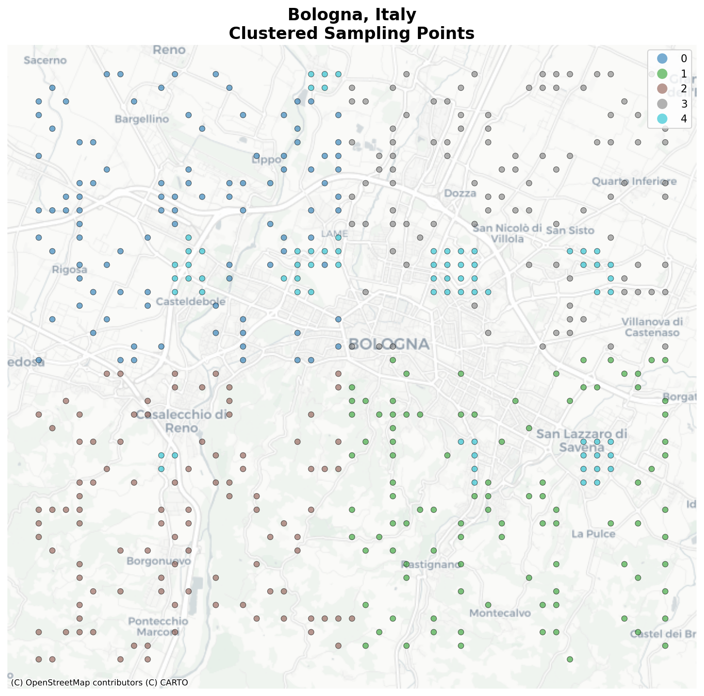
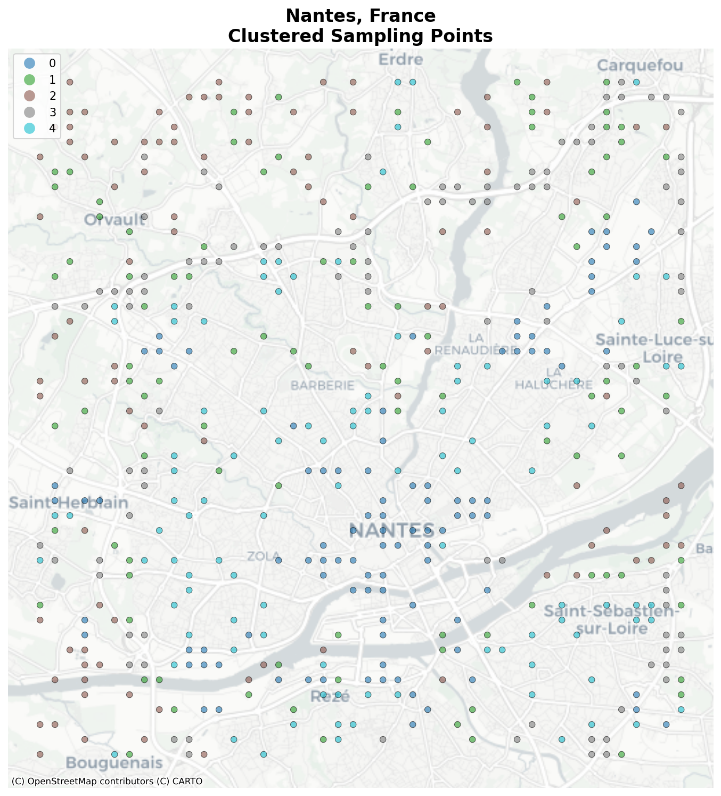

## Table of Contents

- [Introduction](#introduction)
- [Input Tensor Construction](#input-tensor-construction)
- [Target Label Generation](#target-label-generation)

# **Introduction**

## 🏙️ Cities

We chose to focus exclusively on Europe for our case study for the following reasons:

- European cities share a **distinctive urban structure**. We limited data collection to cities with this characteristic, excluding those with fundamentally different layouts (such as American and Chinese cities);

- **Abundant free geospatial data** is available for Europe.

Moreover, we selected countries for which population data is available via [**iso4app**](https://www.iso4app.net/).

These dataset considers **90 major cities** in **12 different European Countries**. Below the list of the cities considered.

| 🇮🇹 **Italy** (9) | 🇫🇷 **France** (10) | 🇬🇧 **United Kingdom** (9) |
| ---------------- | ------------------ | ------------------------- |
| Rome             | Paris              | London                    |
| Milan            | Marseille          | Birmingham                |
| Naples           | Lyon               | Edinburgh                 |
| Turin            | Toulouse           | Leeds                     |
| Palermo          | Nice               | Liverpool                 |
| Bologna          | Nantes             | Manchester                |
| Florence         | Montpellier        | Bristol                   |
| Bari             | Strasbourg         | Sheffield                 |
| Catania          | Bordeaux           |                           |
|                  | Lille              |                           |

| 🇧🇪 **Belgium** (7) | 🇳🇱 **Netherlands** (7) | 🇸🇪 **Sweden** (7) | 🇨🇭 **Switzerland** (7) |
| ------------------ | ---------------------- | ----------------- | ---------------------- |
| Brussels           | Amsterdam              | Stockholm         | Zurich                 |
| Antwerp            | Rotterdam              | Gothenburg        | Geneva                 |
| Ghent              | The Hague              | Malmö             | Basel                  |
| Charleroi          | Utrecht                | Uppsala           | Lausanne               |
| Liège              | Eindhoven              | Västerås          | Bern                   |
| Bruges             | Tilburg                | Örebro            | Winterthur             |
| Namur              | Groningen              | Linköping         | Lucerne                |

| 🇦🇹 **Austria** (6) | 🇫🇮 **Finland** (6) | 🇵🇹 **Portugal** (6) | 🇳🇴 **Norway** (5) |
| ------------------ | ------------------ | ------------------- | ----------------- |
| Vienna             | Helsinki           | Lisbon              | Oslo              |
| Graz               | Espoo              | Porto               | Bergen            |
| Linz               | Tampere            | Vila Nova de Gaia   | Trondheim         |
| Salzburg           | Vantaa             | Amadora             | Stavanger         |
| Innsbruck          | Oulu               | Braga               | Tromsø            |
| Klagenfurt         | Turku              | Coimbra             |                   |

| 🇩🇰 **Denmark** (1) | 🇬🇷 **Greece** (2) |
| ------------------ | ----------------- |
| Copenhagen         | Volos             |
|                    | Thessaloniki      |

## Input Tensor Construction

What we want to achieve for the input is a **3D tensor** with:

- **13 channels** (expanded from raw data);
- **H x W** pixels depending on the city;
- **10m spatial resolution**.

Each channel is explained below:

| Channel | Source | Resolution | Classes/Range |
| :--- | :--- | :--- | :--- |
| **RGB** _3 channels_ | Sentinel-2 (Copernicus) | 10m | True color (B4, B3, B2) normalized [0-255] |
| **Height** _1 channel_ | Copernicus DEM (GLO-30) | 30m (Upsampled to 10m) | Absolute Elevation (meters) |
| **Vegetation** _1 channel_ | Sentinel-2 (Calculated) | 10m | NDVI Index [-1.0 to 1.0] |
| **Land Use** _8 channels_ | OpenStreetMap (OSM) | 10m | **One-Hot Encoded** Binary Masks (0/1) for each class (8 classes) |

### RGB Images (Sentinel-2) & Vegetation (NDVI)

**Script:** `get_imgs_sentinel_2.py`

Both RGB and Vegetation data are derived from the **Sentinel-2 L2A** satellite mission.

- **RGB**: We extract the Red, Green, and Blue bands (10m resolution).
- **NDVI (Vegetation)**: Instead of using an external product, we calculate the Normalized Difference Vegetation Index directly from the *same* Sentinel-2 capture.
  - **Formula**: $$NDVI = \frac{(NIR - Red)}{(NIR + Red)}$$
  - This ensures 100% temporal consistency.

### Height Data (Copernicus DEM)

**Script:** `get_city_dem.py`

For elevation, we use the **Copernicus DEM (GLO-30)** via Microsoft Planetary Computer.

- **Source Resolution**: 30m.
- **Processing**: The script automatically upsamples this data to our target **10m grid** using **Bilinear Interpolation** to smooth artifacts.

### Land Use Data (OpenStreetMap)

**Script:** `get_landuse_osm.py`

To distinguish between functional urban zones (e.g., Commercial vs. Residential), we generate land use masks directly from **OpenStreetMap (OSM)**.

- **Why OSM?** Unlike Urban Atlas (which is updated every 6 years, last 2018), OSM provides near real-time data, ensuring the land use labels match the temporal reality of our 2022-2023 satellite imagery.
- **Methodology**:
  - We download vector polygons for specific `landuse`, `amenity`, and `leisure` tags using `osmnx`.
  - We rasterize these polygons onto the target **10m grid**, aligning them perfectly with the Sentinel-2 pixels.
- **Classes**: The resulting single-channel image contains integer codes [0-7] which are **One-Hot Encoded** during training into 8 binary channels.

### RGB Images (Sentinel-2) & Vegetation (NDVI)

**Script:** `get_imgs_sentinel_2.py`

Both RGB and Vegetation data are derived from the **Sentinel-2 L2A** satellite mission.

- **RGB**: We extract the Red, Green, and Blue bands (10m resolution).
- **NDVI (Vegetation)**: Instead of using an external product (which might be temporally misaligned), we calculate the Normalized Difference Vegetation Index directly from the *same* Sentinel-2 capture using the Near-Infrared (NIR) and Red bands.
  - **Formula**: $$NDVI = \frac{(NIR - Red)}{(NIR + Red)}$$
  - This ensures 100% temporal consistency: if a tree appears in the RGB image, it will have a corresponding high value in the NDVI channel.

### Height Data (Copernicus DEM)

**Script:** `get_city_dem.py`

For elevation, we use the **Copernicus DEM (GLO-30)** via Microsoft Planetary Computer.

- **Source Resolution**: 30m.
- **Processing**: The script automatically upsamples this data to our target **10m grid** using **Bilinear Interpolation**. This smooths the values to prevent "stair-step" artifacts, providing a continuous elevation surface that aligns perfectly with the Sentinel-2 pixels.

### Land Use Data (OpenStreetMap)

**Script:** `get_landuse_osm.py`

To distinguish between functional urban zones (e.g., Commercial vs. Residential), we generate land use masks directly from **OpenStreetMap (OSM)**.

- **Why OSM?** Unlike standard land cover maps (which only distinguish "Concrete" vs. "Grass"), OSM tags allow us to differentiate between **Residential**, **Commercial**, and **Industrial** areas. This semantic distinction is critical for estimating population behavior.
- **Methodology**:
  - We download vector polygons for specific `landuse`, `amenity`, and `leisure` tags using `osmnx`.
  - We rasterize these polygons onto the target **10m grid**, aligning them perfectly with the Sentinel-2 pixels.
- **Classes**: The resulting single-channel image contains integer codes representing:
  * Residential
  * Commercial/Office
  * Industrial
  * Retail
  * Public/Education
  * Parks/Leisure
  * Natural/Water
  * Other/Background
- **Tensor Transformation**: This channel is **One-Hot Encoded** during training into **8 binary channels** (one for each active class).
- 
## RGB Images (Sentinel-2 | Copernicus)

The RGB images we got are from **Sentinel-2** satellite, they are at a **10m resolution**. More specifically the script in charge of downloading images can be founder here [`get_RGB_sentinel.py`](get_RGB_sentinel.py).

**Key Features & Methodology:**

- **Census-Aligned Temporal Synchronization:**

  The script dynamically adjusts the search window for each city to match the specific year of its national census (e.g., _Summer 2018_ for Switzerland, _Summer 2023_ for Italy). This ensures the physical urban fabric observed in the images corresponds accurately to the demographic data used in the analysis. More specifically these are the population data available:

  | Country            | Population Source  | Census Year | Satellite Image Year\* |
  | :----------------- | :----------------- | :---------- | :--------------------- |
  | **Austria** 🇦🇹     | HDX                | 2020        | 2020                   |
  | **Belgium** 🇧🇪     | STATBEL            | 2020        | 2020                   |
  | **Denmark** 🇩🇰     | DST                | 2024        | 2023                   |
  | **Finland** 🇫🇮     | STATISTICS FINLAND | 2022        | 2022                   |
  | **France** 🇫🇷      | INSEE census       | 2020        | 2020                   |
  | **Greece** 🇬🇷      | GEODATA.GOV.GR     | 2020        | 2020                   |
  | **Italy** 🇮🇹       | ISTAT census       | 2024        | 2023                   |
  | **Netherlands** 🇳🇱 | CBS                | 2022        | 2022                   |
  | **Norway** 🇳🇴      | SSB                | 2024        | 2023                   |
  | **Portugal** 🇵🇹    | INE                | 2018        | 2018                   |
  | **Sweden** 🇸🇪      | SCB                | 2020        | 2020                   |
  | **Switzerland** 🇨🇭 | STATPOP            | 2018        | 2018                   |

  > \* _Note: For 2024 census releases (Italy, Denmark, Norway), satellite imagery from Summer 2023 is used as the closest complete summer season._

You can check directly on [**iso4app**](https://www.iso4app.net/) website for specifications about the census data we used.

- **Seasonal Consistency (European Summer):**

  - All images are restricted to the months of **June through September**.
  - This "Summer Window" is critical for Northern Europe (e.g., Norway, Finland) to ensure scenes are **snow-free**, have maximum solar elevation (minimizing long shadows in urban canyons), and show vegetation at peak greenness for consistent spectral analysis.

- **Cloud-Free Mosaicing:**

  - Queries the **Sentinel-2 L2A** collection via the STAC API, strictly filtering for scenes with **<95% cloud cover**, basically keeping only those images where a portion of the city is visible.
  - When multiple passes are available, it computes a **median pixel composite**. This technique effectively removes transient clouds, shadows, and artifacts that might appear in a single flyover, resulting in a clean, obstruction-free image.

- **Post-Processing:**
  - **Bands:** Extracts RGB bands (10m resolution).
  - **Normalization:** Clips and scales raw reflectance values to standard 8-bit RGB integers.
  - **Export:** Saves the final output as georeferenced TIFFs (`EPSG:3857`) ready for computer vision tasks.

Examples below of satellite imgs for **Bologna** and **Nantes**.

<table>
  <tr>
    <td align="center">
      
       
      <b>Figure 1:</b> Sentinel-2 Capture of Bologna, Italy
    </td>
    <td align="center">
      
       
      <b>Figure 2:</b> Sentinel-2 Capture of Nantes, France
    </td>
  </tr>
</table>

### Height Data (Copernicus DEM)

**Script:** `get_city_dem.py`

For elevation data, we utilize the **Copernicus DEM (GLO-30)**, which provides global coverage at 30m resolution. While the native resolution is 30m, we upsample it to match our target 10m tensor grid.

- **Source**: Microsoft Planetary Computer (`cop-dem-glo-30` collection).
- **Methodology**:
  - **Authentication**: Uses dynamic SAS token signing via the `planetary-computer` library to access Azure Blob Storage.
  - **Resampling**: Since the source is 30m and our target is 10m, the script applies **Bilinear Interpolation** during the download. This smooths the transition between pixels, preventing the "stair-step" artifacts that occur with standard nearest-neighbor upsampling.
  - **Void Filling**: Automatically fills missing data points (common over water bodies) with zero.
- **Output**: A single-channel, 32-bit Float GeoTIFF representing absolute elevation in meters.

### Segmentation Data (ESA WorldCover)

**Script:** `get_segmentation_esa.py`

To provide the model with semantic understanding of the urban layout, we use the **ESA WorldCover 10m** product. This provides a per-pixel classification of land use.

- **Source**: ESA WorldCover v2021 (via Microsoft Planetary Computer `esa-worldcover` collection).
- **Classes**: The data consists of discrete integer labels representing 11 distinct land cover classes.
  - **Key Classes**: `10` (Trees), `40` (Cropland), `50` (Built-up/Urban), `80` (Permanent Water).
- **Usage Note**: Since these values are categorical integers (not continuous), they are intended to be **One-Hot Encoded** during model training (expanding 1 channel into 11 binary channels) to prevent the model from misinterpreting categorical IDs as intensity values.

### Vegetation (NDVI)

**Script:** Integrated into `get_imgs_sentinel_2.py`

Instead of downloading a separate vegetation product (like HR-VPP), we calculate the **Normalized Difference Vegetation Index (NDVI)** directly from the Sentinel-2 imagery.

- **Why calculate it manually?**
  - **Temporal Alignment**: By calculating NDVI from the *exact same* Sentinel-2 capture used for the RGB channels, we guarantee 100% temporal synchronization. This ensures that if a tree is visible in the RGB image, it appears as "high vegetation" in the NDVI channel. External products often average data over different weeks, leading to mismatches (e.g., a tree pruned between the two capture dates).
- **Formula**:
  $$NDVI = \frac{(NIR - Red)}{(NIR + Red)}$$
  Where $NIR$ is Band 8 and $Red$ is Band 4 of the Sentinel-2 L2A product.
- **Output**: A single-channel file with values ranging from **-1.0 to 1.0**, where high positive values indicate dense, healthy vegetation, and low/negative values indicate built-up areas or water.

# Target Label Generation

This pipeline automates the extraction of urban data across major European cities. It progresses from defining geographical boundaries to generating stratified sampling points based on urban density, and finally enriching those points with walking isochrones and population data.

## Pipeline Overview

The workflow consists of three sequential stages:

1.  **Scope Definition**: Extracts bounding boxes for target cities.
2.  **Sampling & Clustering**: Generates points, calculates urban density metrics (roads, buildings, POIs), clusters them to ensure diverse representation (e.g., city center vs. suburbs), and selects a stratified sample.
3.  **Enrichment**: Queries external APIs to calculate 15-minute walking areas and population counts for the selected points.

---

## 📂 **Script Details**

### 1. City Bounding Box Generator

**Script:** `city_bounding_box_generator.py`

This script initializes the project by defining the geographical scope. It iterates through a the cities listed earlier and uses OpenStreetMap (OSMnx) to retrieve their geographical boundaries.

- **Input**: A hardcoded list of city names (e.g., "Rome, Italy", "Paris, France").
- **Logic**:
  - Geocodes each city name to a GeoDataFrame.
  - Extracts the `total_bounds` (min/max lat/lon).
  - Formats coordinates into a polygon structure.
- **Output**: `cities_bboxes_major_europe.json` containing the bounding box coordinates for each successfully processed city.

### 2. Parallel Sampling & Clustering

**Script:** `point_clusters_generator.py`

This is the core processing engine. It moves from raw bounding boxes to a set of intelligent, representative points for analysis. It uses parallel processing to handle large datasets efficiently.

- **Input**: `cities_bboxes_major_europe.json`
- **Logic**:
  - **Adaptive Grid**: Generates a grid of candidate points within the city bounding box.
  - **Parallel Data Fetching**: Uses a `ThreadPoolExecutor` to download OSM features (Roads, Buildings, POIs) in 3km chunks to avoid API timeouts.
  - **Metric Calculation**: For every grid point, it calculates density within a 250m buffer:
    - _Road Density_: Total length of road network.
    - _Building Density_: Total footprint area of buildings.
    - _POI Density_: Count of amenities, shops, and offices.
  - **K-Means Clustering**: Normalizes these metrics and groups points into **5 clusters** (representing different urban fabrics, e.g., "Dense Historic Center", "Residential", "Sparse Industrial").
  - **Stratified Sampling**: Selects a fixed number of random points (default: 100) from each cluster to ensuring the final dataset represents the full diversity of the city.
- **Output**: `final_clustered_samples.json` (A JSON list of sampled points with their cluster IDs and density metrics).
- **Visualization**: Saves cluster maps to `./imgs/cluster_images/` for visualization and verification.

Exmaples below:

<table>
  <tr>
    <td align="center">
      
       
      <b>Figure 1:</b> Clustered Points of Bologna, Italy
    </td>
    <td align="center">
      
       
      <b>Figure 2:</b> Clustered Points of Nantes, France
    </td>
  </tr>
</table>

### 3. Isochrone Enrichment

**Script:** `population_isochrones_generator.py`

This script adds human-centric mobility data to the clustered points using the [**iso4app API**](https://www.iso4app.net/). It operates "in-place," meaning it updates the existing dataset.

- **Input**: `final_clustered_samples.json`, the list of points previously computed
- **Logic**:
  - **Isochrone Calculation**: Queries the API for a 15-minute walking polygon (pedestrian mobility) starting from the point's coordinates.
  - **Population Lookup**: Uses the generated polygon to query the API for the total population living within that specific walking area.
  - **Error Handling**: Includes retry logic and periodic saving (every 50 points) to prevent data loss.
- **Output**: Updates `final_clustered_samples.json` by appending:
  - `walking_isochrone`: The GeoJSON geometry of the walkable area.
  - `population_15min_walk`: The integer count of people inside that area.
  - `approximation_meters`: Distance from the query point to the nearest walkable street.
